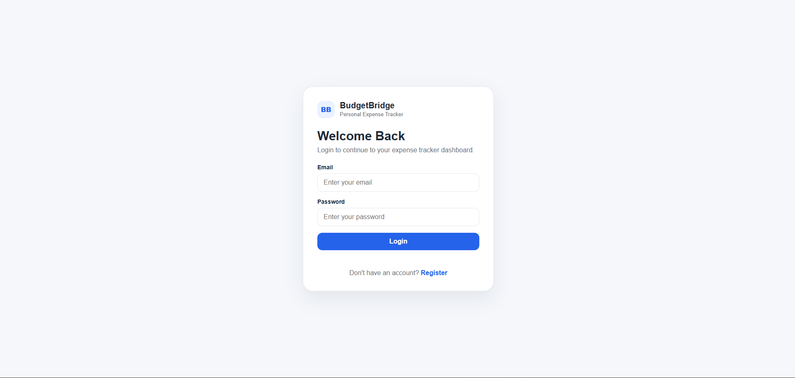
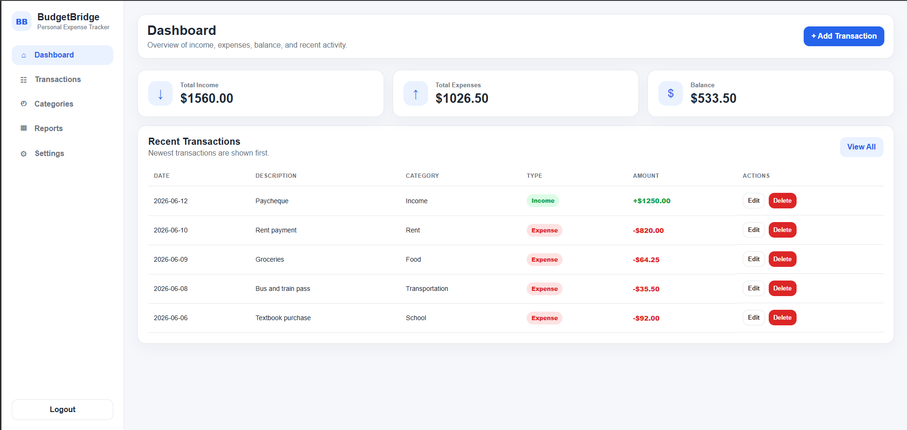
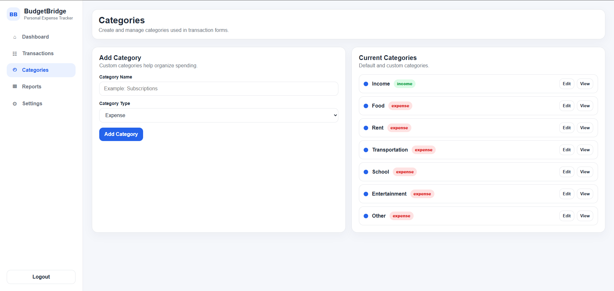
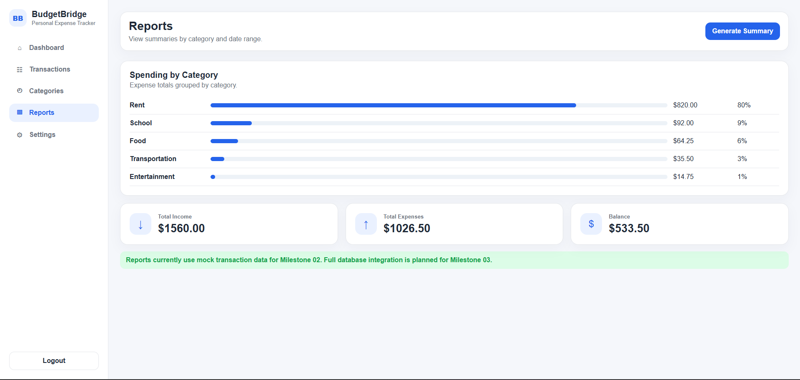

# BudgetBridge: Personal Expense Tracker

## CP476B Group 6 - Milestone 03 Final

BudgetBridge is a full-stack personal expense tracker for students and young adults. Users can create an account, record income and expenses, organize transactions by category, search and filter records, and generate financial summaries. The final application connects a plain HTML/CSS/JavaScript front end to a Node.js API and a MySQL relational database.

## Screenshots

<table width="100%">
  <tr>
    <td align="center" width="50%">
      <br>
      <b>Login</b>
    </td>
    <td align="center" width="50%">
      <br>
      <b>Dashboard</b>
    </td>
  </tr>
  <tr>
    <td align="center" width="50%">
      <br>
      <b>Categories</b>
    </td>
    <td align="center" width="50%">
      <br>
      <b>Reports</b>
    </td>
  </tr>
</table>

## Final Status

- MySQL database created successfully with five tables
- End-to-end data persistence verified after logout and login
- Transaction and category CRUD connected to MySQL
- Dashboard and date-range reports connected to database queries
- Final automated result: **12 passed, 0 failed**
- Final MySQL Reports compatibility defect fixed and retested

## Core Features

- Account registration, login, logout, and session verification
- Secure password hashing with Node.js `crypto.scrypt`
- HTTP-only SameSite session cookie; only session-token hashes are stored in MySQL
- Transaction create, read, update, delete, search, and filtering
- Custom category create, edit, and delete with protected defaults
- Dashboard totals and recent transactions
- Date-range reports and spending grouped by category
- Profile and password updates
- Server-side validation, ownership checks, parameterized SQL, security headers, and request-size limits

## Technology Stack

- Front end: HTML, CSS, JavaScript
- Back end: Node.js built-in HTTP module
- Database: MySQL 8.x using `mysql2`
- Tests: Node.js built-in test runner
- Version control and tracking: GitHub and GitHub Projects

No front-end framework or UI library is used.

## Project Structure

```text
budgetbridge-expense-tracker/
├── backend/
│   ├── controllers/
│   ├── data/
│   ├── routes/
│   ├── utils/
│   ├── config.js
│   └── server.js
├── database/
│   └── schema.sql
├── docs/
│   ├── activity-blog.md
│   ├── budgetbridge-final-overview.pdf
│   ├── demo-video-script.md
│   ├── final-kanban-update.md
│   ├── testing-summary-report.pdf
│   └── screenshots/final/
├── public/
│   ├── css/style.css
│   ├── js/app.js
│   └── *.html
├── tests/
├── .env.example
├── .gitignore
├── links.txt
├── package.json
└── README.md
```

# Clean-Machine Local Setup

## Prerequisites

- Node.js 18 or newer
- MySQL Server 8.x
- MySQL Workbench or the MySQL command-line client
- A modern browser

## 1. Extract and open the project

Open a terminal inside the folder containing `package.json`.

Windows check:

```bat
dir package.json
```

macOS/Linux check:

```bash
ls package.json
```

## 2. Install the Node.js dependency

```bash
npm install
```

## 3. Create the database

Open `database/schema.sql` in MySQL Workbench and execute the entire script.

Expected schema:

```text
budgetbridge_db
├── activity_logs
├── categories
├── transactions
├── user_sessions
└── users
```

The setup script recreates the database. Do not rerun it after creating data that must be preserved.

Command-line alternative:

```bash
mysql -u root -p < database/schema.sql
```

## 4. Create the local environment file

Copy `.env.example` to `.env`.

Windows:

```bat
copy .env.example .env
notepad .env
```

macOS/Linux:

```bash
cp .env.example .env
```

Set the values for the local MySQL installation:

```text
PORT=3000
NODE_ENV=development
DB_MODE=mysql
DB_HOST=127.0.0.1
DB_PORT=3306
DB_USER=root
DB_PASSWORD=your_local_mysql_password
DB_NAME=budgetbridge_db
SESSION_DAYS=7
```

Use `DB_PORT=3307` when MySQL was configured on port 3307.

Never commit `.env`. It is excluded through `.gitignore`.

## 5. Start the final MySQL version

```bash
npm start
```

Expected terminal output includes:

```text
BudgetBridge server running at http://localhost:3000
Database mode: mysql
```

Open:

```text
http://localhost:3000
```

Register a new account. Default income and expense categories are created automatically.

## 6. Verify persistence

1. Add an income transaction.
2. Add an expense transaction.
3. Confirm the Dashboard totals update.
4. Log out.
5. Log back in.
6. Confirm the transactions remain available.

## 7. Run automated tests

Stop the running server with `Ctrl + C`, then run:

```bash
npm test
```

Final verified result:

```text
tests 12
pass 12
fail 0
```

The tests cover authentication, transaction CRUD, category CRUD and protection rules, reports, filters/search, validation, password hashing, session security, password updates, and cross-user isolation.

## Optional Memory Mode

Memory mode is provided only for repeatable automated testing and quick UI review. It does not replace the required MySQL setup.

```bash
npm run start:memory
```

# API Endpoints

```text
POST   /api/auth/register
POST   /api/auth/login
POST   /api/auth/logout
GET    /api/auth/session

GET    /api/transactions
GET    /api/transactions/:id
POST   /api/transactions
PUT    /api/transactions/:id
DELETE /api/transactions/:id

GET    /api/categories
POST   /api/categories
PUT    /api/categories/:id
DELETE /api/categories/:id

GET    /api/reports/summary
GET    /api/user/profile
PUT    /api/user/profile
PUT    /api/user/password
```

# Validation and Security Hygiene

- Passwords are never stored as plain text.
- User-controlled SQL values use parameterized placeholders.
- The validated recent-transaction limit is restricted to an integer from 1 to 100 before being added to the SQL statement.
- Every transaction and category query includes the authenticated user's ID.
- Raw session tokens are kept only in an HTTP-only cookie; MySQL stores SHA-256 hashes.
- State-changing requests are checked for same-origin use.
- Security headers include CSP, frame blocking, MIME-sniffing prevention, and restrictive permissions.
- Invalid or oversized request bodies are rejected.
- Default categories cannot be edited or deleted.
- Categories used by transactions cannot be deleted.

# Known Limitations

- Local course demonstration; not publicly deployed
- Canadian-dollar display only
- No bank synchronization or automatic reconciliation
- No email password-reset service
- No multi-factor authentication
- Reports provide summaries rather than forecasting

# Team Contributions

- **Thesopan Sathiyanantham** - Scrum Master / Project Coordinator: coordination, integration review, GitHub tracking, README, and final packaging
- **Aditya Arun Kumar** - Back-End Lead: API design, authentication, sessions, and controllers
- **Fisher Matichuk** - Front-End Lead: page workflow, front-end integration, and responsive review
- **Noor Ehsan** - Database Lead: schema, constraints, queries, and data-integrity review
- **Jana Nazer** - Documentation Lead: activity blog, final documentation, and presentation review
- **Rida Shahid** - Testing / QA Lead: test plan, validation testing, and workflow verification
- **Tahmina Faez** - UI/UX Support: consistency, accessibility review, and wireframe alignment
- **Rafay Khan** - GitHub / Kanban Support: task ownership and board maintenance
- **Sahil Minhas** - Reports Support: aggregation queries and report workflow
- **Ravishan Thanarajah** - Review Support: clean-machine review and final packaging checks

# Final Documentation

- Testing report: `docs/testing-summary-report.pdf`
- One-page overview: `docs/budgetbridge-final-overview.pdf`
- Final Kanban snapshot: `docs/final-kanban-update.md`
- Activity blog and reflection: `docs/activity-blog.md`
- Demo plan: `docs/demo-video-script.md`
- Final links: `links.txt`
